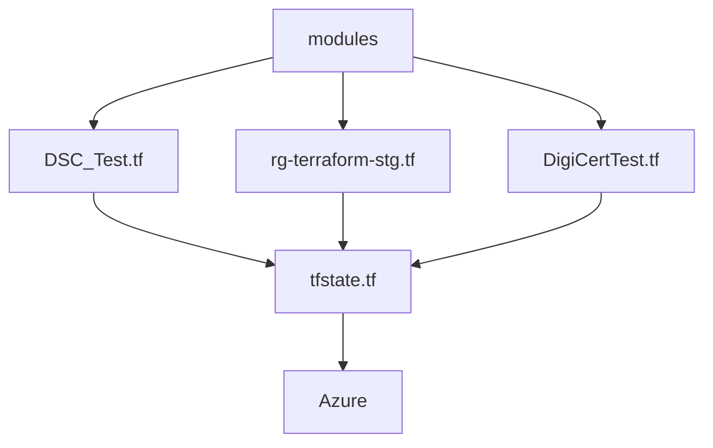

# az-tf-sensatech
[](https://github.com/Tommi-Sensa/az-tf-sensatech/actions/workflows/azure-functions-app-container.yml)


Test to use terraform for sensatech azure management


### Terraform flow




### Azure Europe North

```geojson
{
  "type": "FeatureCollection",
  "features": [
    {
      "type": "Feature",
      "id": 1,
      "properties": {
        "ID": 0
      },
      "geometry": {
        "type": "Polygon",
        "coordinates": [
          [
              [-21.82774,64.128288],
              [-9,54]
          ]
        ]
      }
    }
  ]
}
```
